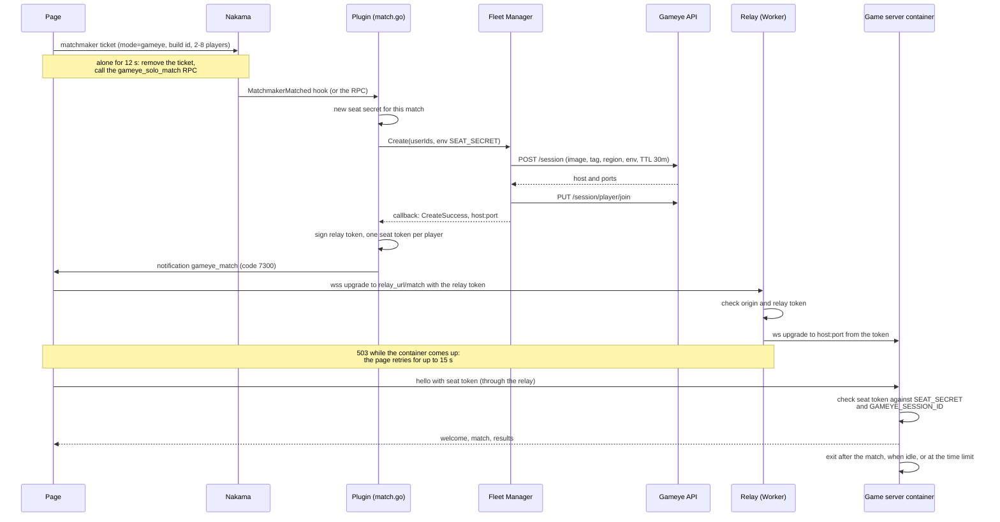

# Scrapyard on Gameye: how it works

This fork runs each quick-play match of Scrapyard in its own [Gameye](https://gameye.com) session. [Nakama](https://heroiclabs.com/nakama/) does the matchmaking. A Go plugin in Nakama starts the session through the [Gameye Fleet Manager for Nakama](https://github.com/Gameye/nakama-fleetmanager), then tells the matched players where to connect. The browser reaches the game server through a small Cloudflare Worker relay.

Custom lobbies, accounts and replays still run on upstream's own server path. Only quick play goes through Gameye.

The code to read first:

| Part | Files |
|---|---|
| Nakama plugin | [`nakama/modules-src/main.go`](nakama/modules-src/main.go), [`match.go`](nakama/modules-src/match.go), [`tokens.go`](nakama/modules-src/tokens.go) |
| Game server in the Gameye container | [`game/server/gameye-main.ts`](game/server/gameye-main.ts), [`gameye-server.ts`](game/server/gameye-server.ts), [`gameye-auth.ts`](game/server/gameye-auth.ts), [`Dockerfile`](Dockerfile) |
| The page | [`game/src/net/gameye-queue.ts`](game/src/net/gameye-queue.ts), [`gameye-match.ts`](game/src/net/gameye-match.ts) |
| Relay | [`edge/worker.js`](edge/worker.js), [`edge/wrangler.jsonc`](edge/wrangler.jsonc) |
| Running it | [`scripts/gameye-up.sh`](scripts/gameye-up.sh), [`compose.gameye.yml`](compose.gameye.yml), [`.env.gameye.example`](.env.gameye.example), [`nakama/Dockerfile`](nakama/Dockerfile), [`.github/workflows/release.yml`](.github/workflows/release.yml) |

The formats these parts share (the matchmaker ticket, the notifications, both tokens, which secret goes where) are written down once, in the Contracts section of [`AGENTS.md`](AGENTS.md). This page explains them; that section is the reference.

## What happens when you press Play



Step by step:

1. **The page queues.** In Gameye mode the page puts a ticket on Nakama's own matchmaker with the properties `mode=gameye` and `build=<the page's build id>`, for 2 to 8 players. The build id keeps pages of different builds out of one match: a page and a game server of different builds don't speak the same protocol.
2. **Alone for 12 seconds,** the page removes its ticket and calls the RPC `gameye_solo_match`. The player gets a match of their own, and bots fill the other seats.
3. **The plugin starts a session.** Nakama's `MatchmakerMatched` hook (or the RPC) calls the Fleet Manager's `Create`. The Fleet Manager starts a Gameye session, waits for its address and joins the players to it.
4. **The plugin tells the players.** Each player gets a `gameye_match` notification with the relay's URL, a relay token and their own seat token.
5. **The page connects through the relay.** The browser can only open `wss://` sockets from an `https://` page, and Gameye containers listen on a bare IP and port. The relay terminates TLS and opens a plain WebSocket to the container. It takes the container's address from the signed relay token, never from the page.
6. **The game server seats the player.** The page's hello carries the seat token. The game server checks it with this match's secret and seats the player.
7. **The session ends itself.** After the match's results, when nobody shows up, when the last player leaves, or at a hard time limit, the process exits and Gameye ends the session. Gameye's TTL is the backstop. After the results the page is told the match is over and keeps the results up, with Play again (a new search) and Exit.

If the session can't start, players get a `gameye_failed` notification with a reason, and the page offers to try again. The plugin retries twice on "no capacity" (HTTP 420) and on Gameye server errors (5xx), and gives up at once on errors a retry won't fix, such as a missing scope.

## The Nakama plugin

The plugin is three files in [`nakama/modules-src/`](nakama/modules-src/). `main.go` reads Nakama's `runtime.env`, builds the Fleet Manager and registers the hook and the RPC. `match.go` turns a match into a Gameye session. `tokens.go` signs the tokens.

### Registration

[`main.go`](nakama/modules-src/main.go) registers the Fleet Manager with Nakama, then the matchmaker hook and the solo RPC:

```go
fm, err := fleetmanager.NewGameyeFleetManager(ctx, cfg.fleet, logger, db, initializer, nk)
if err != nil {
	return err
}
if err := initializer.RegisterFleetManager(fm); err != nil {
	return err
}

matches := newGameyeMatches(fm, nk, logger, cfg.relaySecret, cfg.relayUrl)
if err := initializer.RegisterMatchmakerMatched(matches.matched); err != nil {
	return err
}
if err := initializer.RegisterRpc(soloRpc, matches.soloMatch); err != nil {
	return err
}
```

Nakama refuses to start if a required `runtime.env` key is missing. The keys are listed under [Gameye application settings](#gameye-application-settings).

### The matchmaker hook

[`match.go`](nakama/modules-src/match.go)'s `matched` takes a match only if every ticket in it says `mode=gameye`. Anything else goes back to Nakama untouched, so the hook can sit beside other matchmaking in the same server. It always returns an empty match id: players learn where to go from a notification, not from a Nakama match.

```go
for _, entry := range entries {
	if mode, _ := entry.GetProperties()[modeProperty].(string); mode != modeGameye {
		return "", nil
	}
	// ...collect the user ids...
}
// ...mark the players as starting, leaving out any already starting or holding good tokens...

// The first ticket traces the Gameye session back to the matchmaker.
m.start(ctx, players, entries[0].GetTicket())
return "", nil
```

The hook leaves out a player whose session is already on its way (the page calls the solo RPC as it takes its ticket back), so nobody lands in two sessions. A player who still holds an earlier match has queued again, so the new match is theirs and the old one is no longer offered for resume.

The solo RPC, `soloMatch`, calls the same `start` for one player. A player whose session is already on its way gets `{"status":"starting"}` and nothing new starts. Otherwise a fresh call (no payload) always starts a new session, so a player who left a match and searches again never gets the old one back. Only a resume, `{"resume":true}`, which the page sends when its socket came back mid-search and it found no match in its notifications, gets the player's match with good tokens back, once.

### Create, with a per-match secret in `gameye.env`

Each attempt makes a fresh seat secret and hands it to the container as env, through the Fleet Manager's reserved metadata key `gameye.env`:

```go
secret, err := newSeatSecret()
// ...

metadata := map[string]any{
	fleetmanager.MetadataKeyExternalId: externalId,
	fleetmanager.MetadataKeyEnv:        map[string]string{envSeatSecret: secret},
}

result, err := m.fm.Create(ctx, len(userIds), userIds, nil, metadata, callback)
```

`Create` returns at once. The callback runs later, after Nakama has cancelled the hook's context, so nothing in the callback uses `ctx`. On success it calls `announce`. On a retryable error it tries again after 1 s, then 2 s, each time with a new secret. Otherwise it sends `gameye_failed`.

A session that started but whose players couldn't be told about it is stopped straight away (`abandon`), so it doesn't run until its TTL.

### NotifyConnectionInfo

`announce` signs one relay token for the session and one seat token per player, then sends them with the Fleet Manager's helper:

```go
extras := func(userId string) map[string]any { return contents[userId] }
if err := fleetmanager.NotifyConnectionInfo(ctx, m.nk, userIds, instance, extras, true); err != nil {
	m.abandon(userIds, instance.Id, err)
	return
}
```

`NotifyConnectionInfo` sends each player a `gameye_match` notification (code 7300) holding `host`, `port` and `session_id`, plus that player's `extras`: `relay_url`, `relay_token`, `seat_token` and `exp`. The notification is persistent, so a page that loses its Nakama socket can list it again after reconnecting.

The page doesn't use `host` and `port` to connect; they are there for logs. It connects to `<relay_url>/match?token=<relay_token>`.

## Seat and relay tokens

There are two tokens because two different things need checking, by two different parties, with two different secrets.

- **The relay token** tells the relay which container to open a socket to. It's signed with `RELAY_SECRET`, which only the plugin and the relay hold. Without it, anyone could use the relay as an open proxy to any IP and port. Every player in a match gets the same relay token.
- **The seat token** tells the game server that this player was matched into this session. It's signed with the match's own `SEAT_SECRET`, which only the plugin and that one container hold. Each player gets their own seat token, naming their Nakama user id and the session id.

Both last 120 seconds: long enough for the page to reach the relay while the container comes up. After the player is seated, the token's expiry doesn't matter.

### Why no Nakama key reaches a container

The obvious alternative is to let the game server check players' Nakama session tokens. That needs Nakama's session signing key in every container. Anyone who could read that key from a container could mint a session for any user. And a Nakama session only proves who a player is, not which match they were put in, so any logged-in player could join any match.

With seat tokens, a container holds one secret that is good for one match and nothing else. It can't sign a Nakama session and can't seat players from another match. The relay never gets a seat secret, and no container gets `RELAY_SECRET`. The game server runs with an empty Nakama key: `key: ''` in [`gameye-server.ts`](game/server/gameye-server.ts).

The token format (`v1.<payload>.<signature>`, HMAC-SHA256), every claim, and the rules for each secret are in [`AGENTS.md`](AGENTS.md), Contracts. The Go signer and verifier in [`tokens.go`](nakama/modules-src/tokens.go) are the reference. [`edge/worker.js`](edge/worker.js) and [`game/server/gameye-auth.ts`](game/server/gameye-auth.ts) port the checks to JavaScript and TypeScript.

## Gameye application settings

### API and token

The plugin and the setup script both default to Gameye's self-serve API, `https://api.sandbox-gameye.gameye.net`, where trial accounts live. Teams on a production contract use `https://api.production-gameye.gameye.net`. Set `GAMEYE_API_URL` to change it. Tokens are made for one platform: a sandbox token is refused by production and the other way round.

You can use one token for everything, or two:

| Who | Scopes | Why |
|---|---|---|
| Nakama (the plugin) | `session:start`, `session:read`, `session:stop` | Start sessions, list and describe them (the Fleet Manager's reaper), stop them |
| `scripts/gameye-up.sh` | `application:read`, `application:write`, `regions:read` | Create or update the application, register the tag, check the tag has reached the region |

The local setup uses one token for both, so it needs all six scopes.

### The application

`scripts/gameye-up.sh` creates or updates the application with these settings. If you set it up by hand, match them:

- **Networking:** bridge.
- **Port:** `7360/tcp`, without Gameye TLS. The game server listens on 7360 (`PORT` in the [`Dockerfile`](Dockerfile)), and the plugin's `GAMEYE_API_PORT` defaults to `7360/tcp`.
- **Region:** one, `eu-central-1` by default (`GAMEYE_REGION`). The plugin always starts sessions in `GAMEYE_API_REGION`.
- **Resources:** 0.5 CPU and 512 MiB, on the `trial` node pool for self-serve accounts (`GAMEYE_NODE_POOL`).
- **Image:** the game server image from the [`Dockerfile`](Dockerfile), public, so Gameye can pull it without credentials.
- **No warm pool.** Gameye serves warm-pool sessions from containers started before the request, and those never see the env passed to `Create`. Without `SEAT_SECRET` the game server refuses to start. The script doesn't configure a warm pool. If one is set for the application and region in Gameye's dashboard, turn it off.

### Container env is visible to your organization

Gameye echoes container env back in a session's labels. The Fleet Manager strips it before it reaches Nakama, but anyone in your Gameye organization with `session:read` can still read it. That's why the only secret in a container is the match's own seat secret: it's new for every match, it's useless outside that one session, and the seat tokens it signs expire after 120 seconds. Don't pass long-lived secrets as session env.

### The plugin's runtime.env

| Key | Required | Default | |
|---|---|---|---|
| `GAMEYE_API_TOKEN` | yes | | Token with the session scopes |
| `GAMEYE_API_IMAGE` | yes | | Gameye application name |
| `GAMEYE_API_IMAGE_VERSION` | yes | | Image tag to run |
| `GAMEYE_API_REGION` | yes | | Region |
| `RELAY_SECRET` | yes | | At least 32 bytes; the relay's Worker secret must be the same |
| `RELAY_URL` | yes | | The relay's origin: `wss://...`, or `ws://localhost:8790` locally |
| `GAMEYE_API_URL` | no | `https://api.sandbox-gameye.gameye.net` | |
| `GAMEYE_API_TTL` | no | `30m` | Gameye stops the session after this |
| `GAMEYE_API_PORT` | no | `7360/tcp` | |

They are secrets: pass them as `--runtime.env KEY=value` flags, as environment variables to the image built from [`nakama/Dockerfile`](nakama/Dockerfile), or in a second, uncommitted config file. Never put them in `nakama/data/config.yml`. More in [`nakama/AGENTS.md`](nakama/AGENTS.md).

### The Nakama image's own keys

The image built from [`nakama/Dockerfile`](nakama/Dockerfile) refuses to start (exit 2) unless it gets session keys of its own, because the game server trusts Nakama's session tokens as they are. With Nakama's public default key anyone could sign a session for any player, and a refresh key equal to the session key would let a 30-day refresh token pass for a session. Set these environment variables, the same keys `deploy/compose.yml` passes upstream:

| Variable | Required | Nakama flag |
|---|---|---|
| `NAKAMA_ENCRYPTION_KEY` | yes | `--session.encryption_key`: not `defaultencryptionkey` |
| `NAKAMA_REFRESH_ENCRYPTION_KEY` | yes | `--session.refresh_encryption_key`: not `defaultrefreshencryptionkey`, and not the session key |
| `NAKAMA_SERVER_KEY` | set it | `--socket.server_key` (the page's `VITE_NAKAMA_KEY`) |
| `NAKAMA_CONSOLE_USERNAME`, `NAKAMA_CONSOLE_PASSWORD` | set them | `--console.username`, `--console.password` |
| `NAKAMA_CONSOLE_SIGNING_KEY` | set it | `--console.signing_key` |
| `NAKAMA_HTTP_KEY` | set it | `--runtime.http_key` (the nightly guest cleanup calls with it) |

Or put them all in the second config file named by `NAKAMA_CONFIG_EXTRA`; the image then leaves the check to you. The values are never printed. `compose.gameye.yml` sets `SCRAPYARD_DEV_DEFAULT_KEYS=1`, which lets the image start on Nakama's defaults: use it only on your own machine.

## Run it locally

`scripts/gameye-up.sh` takes you from a clone to a match on your own Gameye account. It sets up your Gameye application and tag, builds and starts Nakama with the plugin (plus Postgres), and starts the relay and the page on your machine. The game servers run on Gameye.

### Prerequisites

- A Gameye account ([trial.gameye.com](https://trial.gameye.com/)) and an API token with all six scopes listed above.
- Node 24 or later, npm, git and curl.
- Docker or Podman, running, with `compose`.

The plugin requires `github.com/Gameye/nakama-fleetmanager` v0.1.0 ([`nakama/modules-src/go.mod`](nakama/modules-src/go.mod)); the image build downloads it, so you don't need a checkout of the Fleet Manager.

### Settings

```sh
cp .env.gameye.example .env.gameye
```

Only `GAMEYE_API_TOKEN` is required. Everything else has a default, shown in the file. The first run generates `RELAY_SECRET` and writes it to `.env.gameye`.

### The game server image: Docker Hub for now

By default Gameye pulls the image this repository publishes, `ghcr.io/gameye/scrapyard-nakama`, at the tag of the commit you have checked out (`sha-<commit>`). The page built on your machine and the image must come from the same commit, or the game server refuses the page.

That default doesn't work yet: Gameye's GHCR integration currently refuses an image whose GitHub owner isn't your Gameye organization's name, with `409` "GHCR repository owner does not match the application organization". A fix is pending.

Until then, build the game server image yourself and push it to a public Docker Hub repository of your own. In `.env.gameye`:

```sh
GAMEYE_GAME_REGISTRY=dockerhub
GAMEYE_GAME_IMAGE=<your Docker Hub user>/scrapyard-nakama
```

Then `docker login`, and run the script with `--push-game-image`. It builds the image for `linux/amd64` from your checkout and pushes it at `sha-<commit>`. Make the repository public: Gameye pulls without credentials.

### Run

See what it would do first. A dry run prints every Gameye API call and every command, and changes nothing:

```sh
scripts/gameye-up.sh --dry-run
```

Then:

```sh
scripts/gameye-up.sh --push-game-image   # first run, or after changing game/
scripts/gameye-up.sh                     # later runs, same commit
```

The script waits until Gameye has the tag in your region, then starts everything. Open `http://localhost:4173` and choose quick play. Open it in a second browser or a private window to share a match: windows of one browser are one guest. Alone, you get a match with bots after 12 seconds.

Ctrl-C stops the page and the relay. Nakama and Postgres keep running until:

```sh
scripts/gameye-up.sh --down
```

Nakama's console is at `http://127.0.0.1:7351` (admin / password: `compose.gameye.yml` runs Nakama on its default keys, with `SCRAPYARD_DEV_DEFAULT_KEYS=1`). `compose.gameye.yml` and upstream's `nakama/compose.yml` both publish port 7350, so run one at a time.

### Troubleshooting

| What you see | What it means |
|---|---|
| `Gameye refused the token (401)` | Wrong token, or a token for the other platform (sandbox and production tokens differ). |
| `the token lacks the ... scope (403)` | Make a token with all six scopes. |
| `Gameye refused the GHCR image ... (409 ...)` | The GHCR owner mismatch above. Switch to Docker Hub. |
| `Gameye can't find <image>:<tag> (404)` | The tag isn't in the registry. Use `--push-game-image`, or set `GAMEYE_GAME_TAG` to a published tag. |
| `tag ... still isn't ready in <region> after 900 s` | Gameye is still pulling the image into the region. Run the script again to keep waiting (`GAMEYE_TAG_WAIT` sets the limit in seconds), or check the image in Gameye's dashboard. |
| `GAMEYE_GAME_TAG isn't this checkout's commit` or `game/ has uncommitted changes` | The page you build won't match the image, and the game server will refuse it ("Game updated"). Commit, then use `--push-game-image`. |
| `port 4173 is taken` / `port 8790 is taken` | Set `PAGE_PORT` or `RELAY_PORT` in `.env.gameye`. |
| The page says "The Gameye demo is unavailable right now" | The plugin got `quota_exceeded` or `misconfigured` (401, 403 or 404 when starting a session). Check Nakama's logs: `docker compose -f compose.gameye.yml logs nakama`. |
| The page says "Couldn’t reach the match server" | No session within 20 s, no capacity, Gameye unavailable, or the relay couldn't reach the container within 15 s. If Nakama's logs say the session is ready, look at the relay's output and the session's logs in Gameye's dashboard. |

## Deploying

Deploying the stack to a server (Nakama, Postgres and the play site behind Caddy, and the relay on Cloudflare) is covered in `deploy/README.md`, which will be added.

The relay deploys on its own with Wrangler; the commands are at the top of [`edge/wrangler.jsonc`](edge/wrangler.jsonc). Its `RELAY_SECRET` must equal the plugin's, and its `ALLOWED_ORIGINS` must name your play site. The game server image also has the allowed origins built in (the `ALLOWED_ORIGINS` build argument in the [`Dockerfile`](Dockerfile)), so build it with your play site's origin.

## Limitations

- **One region.** Every session starts in `GAMEYE_API_REGION`.
- **No latency-based placement.** The Fleet Manager ignores player latencies. Choosing a region from Gameye's `/available-location` ping targets is follow-up work.
- **No backfill or rejoin.** A match is the players matched at the start, plus bots. A player whose socket drops can't get back into the match, and nobody new joins a running one.
- **No spend caps.** Spending is bounded only by each session ending itself (after the match, when idle, or after 20 minutes) and by Gameye's TTL (30 minutes by default). There is no cap on concurrent sessions and no per-player rate limit.
- **sslip.io in the relay.** Cloudflare Workers can't fetch a bare IP, so the relay turns the container's IP into a hostname under `sslip.io`, a public wildcard DNS service. Set `GAMEYE_IPV4_DNS_SUFFIX` to use your own wildcard zone.
- **Plaintext between the relay and the container.** The browser-to-relay hop is TLS. The relay-to-container hop is a plain `ws://` socket over the internet.
- **Logging out of Nakama doesn't revoke a seat.** A seat token stays good until it expires, 120 seconds after it was issued.
- **Quick play only, one mode.** Gameye matches are free for all on the Scrapyard arena. Custom lobbies and the rest still run on upstream's own server path.
