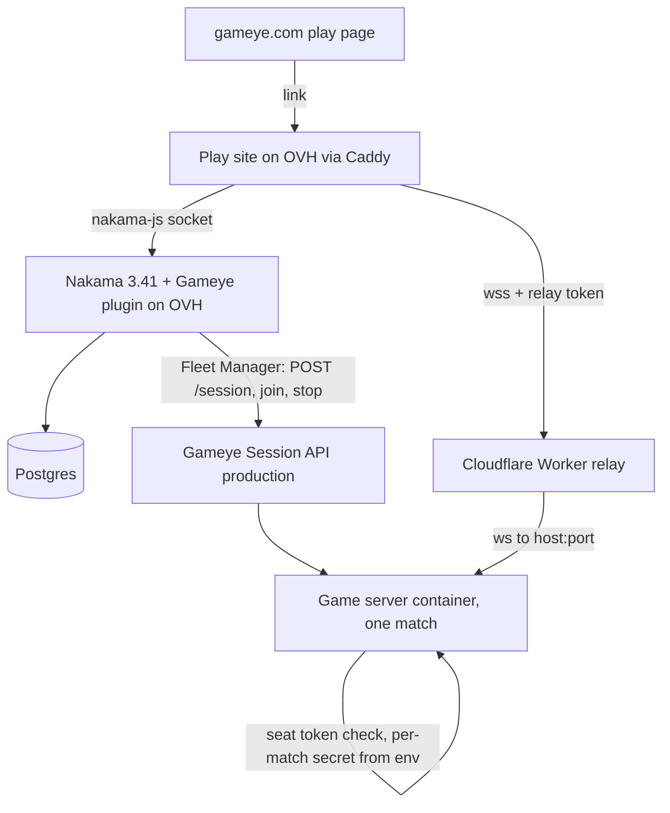
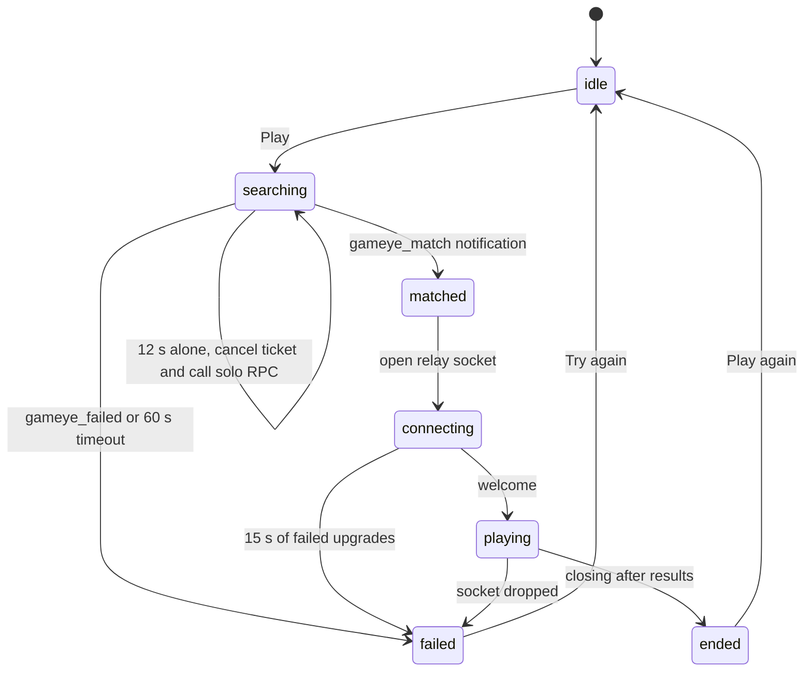

# Nakama + Gameye Reference Game - Plan

**Target repos** (paths in each unit are relative to the repo named on its **Repo:** line):

- `nakama-fleetmanager`: github.com/Gameye/nakama-fleetmanager
- `scrapyard-nakama`: github.com/Gameye/scrapyard-nakama (this repo; fork of aasumitro/bbmvc)
- `gameye-website`: gitlab.com/gameye/website/gameye-astro
- `gameye-documentation`: the Gameye docs site (one page only)

---

## Goal Capsule

- **Objective:** A prospect evaluating Gameye for a Nakama game can play a real Nakama-matched match hosted on Gameye from gameye.com, and can clone a working reference to run the same flow on their own Gameye account.
- **Means:** Update the Gameye Nakama Fleet Manager for Nakama 3.41, then build the Gameye path into a fork of the Scrapyard browser game: Nakama matchmaker → Fleet Manager → one Gameye session per match, with seat tokens and a Cloudflare relay (KTD1–KTD13).
- **Authority:** User instructions in this session > this plan's Requirements > KTDs > unit Approach. The Gameye workspace rules (DECISIONS.md, Workbench) apply to website and docs changes.
- **Stop conditions:**
  - Stop and report if production Gameye rejects env on session start, or if a warm pool is configured for the demo application (seat tokens cannot work; see KTD3).
  - Stop and report if the Nakama 3.41 plugin cannot load the Fleet Manager after the dependency pins in U1.
  - Do not link gameye.com to the demo (U14) until the production smoke match in U13 passes.
- **Execution profile:** Fleet Manager units (U1–U5) land and are tagged first; game units (U6–U12) build on the tagged release; ops and website (U13–U14) last.
- **Who finishes:** Implementation by a coding agent or engineer. Andrew supplies the OVH box access, the subdomain choice and the production Gameye token, and merges the website change.

---

## Product Contract

### Summary

Refresh `Gameye/nakama-fleetmanager` so it builds and runs on Nakama 3.41 against Gameye's current production API, with tests and a README a prospect can follow end to end. Turn `Gameye/scrapyard-nakama` into a deployable reference: Nakama's matchmaker starts one Gameye session per match, players join with per-match seat tokens through a Cloudflare relay, and it ships as GHCR images, a one-command local setup and a walkthrough. Host it on Andrew's OVH box and link a play page on gameye.com to it.

### Problem Frame

Gameye's Nakama Fleet Manager has not changed since April 2025. It pins nakama-common v1.36.0, does not compile against Nakama 3.39+, breaks silently under 3.39's matchmaker context cancellation, points at a dead API host and never tells players where to connect. The other Nakama hosting integrations (GameLift, Edgegap, i3D.net) were updated within the last month. Heroic Labs lists Edgegap and GameLift as verified fleet-manager integrations and Gameye is absent; Andrew is about to ask Heroic Labs for a Gameye guide in the Nakama docs. That ask needs a current package and something a reader can play.

Upstream Scrapyard (Nakama 3.41, MIT) is a real browser game with an authoritative Node server, but it runs its own matchmaker inside one long-lived server process. Nothing in it starts game servers on demand. The earlier `scrapyard-gameye` fork proved the Gameye side (one match per session, GHCR, relay) against Gameye Rooms, not Nakama.

### Requirements

**Fleet Manager package**

- R1. The package compiles with nakama-common v1.48.0 and loads as part of a Nakama 3.41.0 Go plugin built with `heroiclabs/nakama-pluginbuilder:3.41.0`, without forcing consumers above the oldest Nakama release that has the current fleet-manager interface (3.39).
- R2. A session started from a `MatchmakerMatched` hook completes even though Nakama cancels the hook's context when it returns.
- R3. Callers can pass environment variables to the game server container; the package never sends those values as session labels and never writes them to Nakama storage.
- R4. The package talks to Gameye's current production Session API (`https://api.production-gameye.gameye.net`), sets a session TTL, and maps quota (402), scope (403), not-found (404) and capacity (420) errors to distinct, documented errors.
- R5. The package has unit tests for every FleetManager method and CI that runs them and builds the plugin inside the 3.41 plugin builder.
- R6. The README and example take a Nakama developer from `go get` to players receiving a server address, including the notification step, without unstated glue code.

**Reference game**

- R7. In Gameye mode, quick play queues on Nakama's matchmaker and each match runs in its own Gameye session on the production self-serve platform.
- R8. Only the players Nakama matched into a session can take a seat in it, and no Gameye container holds a Nakama signing key, server key or http key.
- R9. A lone visitor reaches a match (with bots) within about 30 seconds of pressing Play.
- R10. If a session cannot start or cannot be reached, the player sees a clear failure within about 30 seconds and can try again; no screen waits forever.
- R11. Every Gameye session ends on its own: after the match, when empty, at a hard time limit, and at the Gameye TTL as a backstop.
- R12. Browsers reach the game container over `wss://` through a relay that decides the container address itself, never from browser input.
- R13. The fork ships as GHCR images (game server, Nakama with plugin), a one-command local setup that uses the developer's own Gameye token, and a walkthrough README that leads with the Nakama and Fleet Manager code.
- R14. Upstream's non-Gameye play (Classic matchmaking, custom lobbies, accounts, replays) still works, and Gameye code stays isolated so upstream changes keep merging.

**Hosting and website**

- R15. The demo runs on Andrew's OVH box behind Caddy with TLS on a gameye.com subdomain, and a deploy cannot leave the image tag, the play bundle and Nakama's configured version out of step.
- R16. gameye.com has a play page and a call to action on `/nakama-integration/` that open the demo, and the site's and docs' Nakama copy matches the updated package.

### Success Criteria

- A first-time visitor clicks Play on gameye.com and is driving in a Gameye-hosted match in under 30 seconds, without creating an account.
- A Nakama developer with a Gameye trial token goes from `git clone` to a local match on Gameye in under 15 minutes using only the walkthrough.
- The Fleet Manager's version line, test badge and README are good enough to link from the Heroic Labs email without caveats.

### Key Decisions

- **Seat tokens, not Nakama session tokens, gate the game server.** The plugin issues a short-lived seat token per matched player, signed with a per-match secret. Governs R8. (session-settled: user-directed — chosen over checking Nakama session JWTs in the container: that needs Nakama's signing key in every container, which allows impersonating any user, and lets any logged-in player join any match.)
- **Production self-serve platform.** Governs R7. (session-settled: user-directed — chosen over planz-development: prospects use production, and dev is less stable.)
- **Andrew's own OVH box hosts Nakama, Postgres and the site.** Governs R15. (session-settled: user-directed — chosen over the Rooms OVH box.)
- **gameye.com links out to the game on its own subdomain.** Governs R16. (session-settled: user-approved — chosen over embedding in the Astro site, which sets `X-Frame-Options: DENY` and would mix cookie consent and cross-site login into the game.)
- **Spend controls stay minimal.** TTL plus self-shutdown only; concurrency caps and rate limits are deferred. Governs R11. (session-settled: user-directed — the user rated spend risk low priority.)
- **Lone players get bots.** After a short wait alone in the queue the page starts a one-human match, filled with bots. Governs R9.

### Scope Boundaries

- Gameye mode replaces only quick play. Custom lobbies, accounts and replays keep running on upstream's own server path.
- One Gameye region for v1 (`eu-central-1` unless Andrew picks another); the play page says where the server is.
- No change to `scrapyard-gameye` or Gameye Rooms.
- No change to Heroic Labs' docs, and no email to Heroic Labs.

#### Deferred to Follow-Up Work

- Concurrent-session cap, per-player rate limits and a "demo busy" state.
- Latency-based region selection using `/available-location` ping targets.
- A fake-fleet local mode for contributors without a Gameye account.
- A Gameye-owned wildcard DNS zone to replace `sslip.io` in the relay; Gameye-native TLS once it leaves its feature flag.
- Storage index and `List(query)` support, server-to-Nakama status RPCs and metrics in the Fleet Manager (parity with GameLift and Edgegap).
- Backfill into running sessions and rejoin after a dropped connection.

### Sources

- Research dossiers: repo patterns, learnings, framework docs and flow analysis, gathered 2026-10-08 (summarised where they shape KTDs).
- nakama-common v1.48.0 `runtime/runtime.go` (FleetManager interface; `Create` return changed in v1.46.0); Nakama v3.41.0 `server/matchmaker.go` (hook context cancelled, commit c3ca2f17).
- Heroic Labs Go dependency rules: heroiclabs.com/docs/nakama/server-framework/go-runtime/go-dependencies/
- Reference integrations: github.com/heroiclabs/nakama-gamelift (a99f081), github.com/edgegap/nakama-edgegap (20d849e), github.com/i3dnet/nakama-i3d (tests pattern).
- Gameye production OpenAPI: `https://api.production-gameye.gameye.net/openapi.yaml` (v1.2.1). Warm pools ignore `env`, `args`, `labels` and `version`.
- Rooms learnings: `rooms-matchmaker/docs/solutions/runtime-errors/allocation-failed-unsealed-platform-capacity-and-evicted-image-tag.md` (evicted tags, retry only transport/5xx).
- `scrapyard-gameye`: `game/server/rooms-auth.ts`, `game/server/main.ts`, `edge/worker.js`, `Dockerfile`, `.github/workflows/ghcr.yml` (patterns to port, not diffs to apply).

---

## Planning Contract

### Key Technical Decisions

- KTD1. **Two tokens, two secrets.** The relay token (`session id, host, port, exp`) is HMAC-signed with a `RELAY_SECRET` shared by the Nakama plugin and the Worker. The seat token (`session id, user id, exp`) is HMAC-signed with a per-match secret the plugin generates and passes to the container as env. The Worker never sees the seat secret, and the container never sees the relay secret or any Nakama key. Both tokens expire 120 seconds after issue and travel in one notification. Instantiates the seat-token Key Decision (R8, R12). The token formats live in the root `AGENTS.md` contracts section before any code is written.
- KTD2. **`Create` returns `{"session_id": <id>}` and runs the API call on a detached context.** The goroutine uses `context.WithoutCancel` plus a timeout; on timeout the callback gets `CreateTimeout`. This satisfies the v1.46 signature and the 3.39 context change (R1, R2).
- KTD3. **Env pass-through via a reserved metadata key.** `Create` diverts `metadata["gameye.env"]` (a `map[string]string`) into the session's `env` and drops it from labels and from stored `InstanceInfo`. Static env can also come from `GameyeConfig.Env`. This keeps the interface signature intact (R3). Gameye may echo container env back in `labels.env` on reads; the package strips it before any storage write. Env only reaches the container on a cold start, so the demo application must have no warm pool; the README states this.
- KTD4. **`Create` with user ids also joins them and populates `SessionInfo`.** The callback receives a complete `InstanceInfo` (deterministic port chosen by a configured container port such as `7360/tcp`, `Metadata` set) so callers do not call `Join` themselves (R6).
- KTD5. **The package ships `NotifyConnectionInfo`.** A small helper sends each matched user a notification carrying host, port, session id and per-user extras supplied by a caller function (so each player can get their own token); the caller chooses whether it is persistent. It keeps the website's "the package handles the rest" claim honest and gives the README a three-step example (R6).
- KTD6. **Readiness by retry, not by callback.** `CreateSuccess` fires on Gameye's 201. The page retries the relay upgrade with backoff for up to 15 seconds; the Worker returns a retryable status while the container is not yet listening. No container-to-Nakama channel is added (R10).
- KTD7. **Failure handling in the hook.** 420 and 5xx retry twice with backoff; 402, 403 and 404 do not retry. Every failure sends the matched players a `gameye_failed` notification with a reason code, logged at error level. A session that started but could not be announced is stopped (R10).
- KTD8. **Gameye code isolated behind small upstream hooks.** New files carry all Gameye logic (`game/server/gameye-*.ts`, `game/src/net/gameye-*.ts`, `nakama/modules-src/`, `edge/`); upstream files gain only option hooks and an import seam. (session-settled: user-directed — chosen over reshaping upstream code freely: keeps upstream changes merging.) Covers R14.
- KTD9. **Worker on its own hostname with an origin allow-list.** It accepts only the play site's origin (plus `http://localhost:*` in its dev environment), forwards `CF-Connecting-IP`, and turns IPs into hostnames through a configurable DNS suffix (`sslip.io` for v1). The game server's per-address limit reads `CF-Connecting-IP` when `TRUST_PROXY` is set, so players behind shared Cloudflare egress are not grouped (R12).
- KTD10. **Nakama ships as a custom image with the plugin, Lua modules and config baked in.** `FROM heroiclabs/nakama:3.41.0`, plugin built in `heroiclabs/nakama-pluginbuilder:3.41.0`; the `.so`, `nakama/data/modules/*.lua` and `nakama/data/config.yml` are copied into `/nakama/data`, and the Gameye compose files do not bind-mount `nakama/data` (a mount would hide the baked plugin). Published to GHCR next to the game server image, so version lockstep comes from image tags (R13, R15).
- KTD11. **One release flow from one commit.** CI builds the game server image, the Nakama image and the site bundle from the same commit, tagged `sha-<full commit>`. The deploy script registers the tag on Gameye, waits until `/tag/{region}/{image}/{version}` reports it exists, then swaps the play bundle and Nakama's `GAMEYE_API_IMAGE_VERSION` together. The Gameye application keeps at least two tags (R15).
- KTD12. **Recovery and cleanup.** The match notification is written persistent. After a socket reconnect the page lists its persistent `gameye_match` notifications, ignores any whose tokens have expired, and deletes the one it consumes; no recovery RPC is needed. A Fleet Manager reaper goroutine (started in `Init`, using the `InitModule` context) lists Gameye sessions every 2 minutes and deletes storage rows Gameye no longer has (R10, R11).
- KTD13. **Solo matches bypass the matchmaker.** Nakama refuses tickets with a minimum below 2 (`server/pipeline_matchmaker.go`), so the page submits a 2–8 ticket and, after 12 seconds without a match, removes it and calls a `gameye_solo_match` RPC. The RPC runs the same path as the matchmaker hook for the caller alone, and returns the caller's existing assignment instead of starting a second session. Nakama's matchmaker runs at `interval_sec: 2`, `max_intervals: 5`, so a pair can match at its minimum within about 10 seconds, before the solo timer fires. The game server fills empty seats with bots, as upstream already does (R9).
- KTD14. **Fleet Manager release `v0.1.0`, compatible with Nakama ≥3.39.** The library's `go.mod` requires nakama-common v1.46.0 (the version that introduced the current `Create` signature) and the Go version of the 3.39 plugin builder; consumers on 3.41 resolve to v1.48.0. `examples/main` and scrapyard-nakama pin v1.48.0 for Nakama 3.41.

### High-Level Technical Design

**Components**



**Match flow**

```mermaid
sequenceDiagram
  participant P as Page
  participant N as Nakama plugin
  participant G as Gameye API
  participant W as Worker
  participant C as Container
  P->>N: matchmaker add (2-8); after 12 s alone, gameye_solo_match RPC
  N->>N: MatchmakerMatched hook: new seat secret
  N->>G: POST /session (env: seat secret, ttl 30m) via Fleet Manager
  G-->>N: 201 host, ports
  N->>G: PUT /session/player/join
  N->>P: notification gameye_match (relay token, seat token, 120 s)
  P->>W: wss upgrade with relay token (retry up to 15 s)
  W->>W: verify relay token, origin allow-list
  W->>C: ws upgrade to host:port (CF-Connecting-IP forwarded)
  P->>C: hello with seat token
  C->>C: verify seat token, seat player
  C-->>P: match, results, closing
  C->>C: exit after match, idle or time limit
```

**Page matchmaking store (directional)**



### Assumptions

- The demo's Gameye application on production has no warm pool, so per-match env reaches the container (verified in U2).
- One Gameye region is enough for the first demo.
- The OVH box can run Podman compose like upstream's `deploy/` setup.

### Open Questions

- **Subdomain name for the play site and relay** (non-blocking; the plan uses `<PLAY_HOST>` and `<RELAY_HOST>` placeholders). Andrew to choose, for example `scrapyard.gameye.com` and `relay.scrapyard.gameye.com`.
- **OVH box hostname and SSH access** (blocking for U12 and U13 only).
- **Do Developer Trial tokens on production carry `application:read`/`application:write` and allow GHCR pulls?** Decides whether `scripts/gameye-up.sh` can create the developer's Gameye application itself (U10) or the walkthrough needs a dashboard step.
- **Does `GET /session` return container env in `labels.env` on production?** Resolved by the U2 smoke check. If yes, the Fleet Manager strips it before writing storage (already planned) and the walkthrough warns that a `session:read` token can read session env.
- **Leave-session body conflict** (docs say `{session, players}`, spec says `{players}`). Not used in v1; recorded for whoever adds leave tracking.

### Risks & Dependencies

| Risk | Mitigation |
|---|---|
| Plugin fails to load on 3.41 due to a shared dependency version | U1 pins nakama-common v1.48.0 and protobuf v1.36.12 and CI builds the plugin in the 3.41 builder (U4) |
| Gameye evicts the image tag Nakama references | KTD11 ordering, tagKeep ≥2, 404 surfaced as `gameye_failed` (KTD7) |
| Production quota exhausted (402) by heavy demo use | Visible failure message; caps deferred by decision; TTL and self-shutdown bound each session |
| `sslip.io` outage breaks the relay | Configurable DNS suffix (KTD9); Gameye wildcard zone deferred |
| Upstream changes conflict with hook points | Hooks kept to option fields and one import seam (KTD8); merge upstream before each release |
| Env readable via `GET /session` | Seat secret is per match and expires with the session; Gameye token stays server-side |

### System-Wide Impact

- **Gameye website and docs** are shared assets: U14 logs in `DECISIONS.md` and notifies the GTM ops session.
- **Gameye production account:** a new public application (`scrapyard-nakama`) and two scoped API tokens. Nakama on OVH holds one with `session:start`, `session:read`, `session:stop` only. `scripts/deploy-gameye.sh` reads a second, with `application:read` and `application:write` only, from the operator's environment at run time; it is never placed in Nakama's runtime env, either image, or `deploy/.env.gameye`.
- **Cloudflare:** a new Worker and DNS records on gameye.com.

---

## Implementation Units

### Phase A: Fleet Manager

### U1. Nakama 3.41 toolchain and interface upgrade

- **Repo:** `nakama-fleetmanager`
- **Goal:** The package compiles against nakama-common v1.48.0 and survives the hook context cancellation.
- **Requirements:** R1, R2
- **Dependencies:** none
- **Files:** `go.mod`, `go.sum`, `vendor/`, `fleetmanager/gameye.go`, `fleetmanager/gameye_test.go`
- **Approach:**
  1. Require nakama-common v1.46.0 with the Go version of `nakama-pluginbuilder:3.39.0` in the library's `go.mod` (KTD14); pin v1.48.0, protobuf v1.36.12 and Go 1.27.1 in `examples/main`; re-vendor.
  2. Change `Create` to the v1.48 signature returning `{"session_id": id}` (KTD2).
  3. Run the API call and storage writes on a detached context with a timeout; emit `CreateTimeout` on expiry.
  4. Use the request id rather than the optional response id (removes the nil dereference).
- **Patterns to follow:** heroiclabs/nakama-gamelift upgrade commit fbbf686 (deps plus signature only).
- **Test scenarios:**
  - `Create` returns a map containing the generated session id and a nil error for a valid request.
  - `Create` called with a context cancelled immediately after return still invokes the callback with `CreateSuccess` when the fake API answers.
  - A fake API that never answers produces `CreateTimeout` after the configured timeout.
  - A 201 response without an `id` field still yields `InstanceInfo.Id` equal to the requested id.
- **Verification:** `go build` with `--buildmode=plugin` succeeds inside both `heroiclabs/nakama-pluginbuilder:3.39.0` and `3.41.0`; the tests above pass.

### U2. Current Session API client and error mapping

- **Repo:** `nakama-fleetmanager`
- **Goal:** The client matches the production spec, sets TTL and external id, picks ports deterministically and maps errors.
- **Requirements:** R4
- **Dependencies:** U1
- **Files:** `api/openapi/client.yaml`, `api/openapi/client_config.yaml`, `pkg/api/generated/openapi/client/api.gen.go`, `gameye/client.go`, `gameye/client_test.go`, `fleetmanager/gameye.go`
- **Approach:**
  1. Refresh `client.yaml` from the production spec and regenerate; update `gameye/client.go` for the renamed `...Body` types.
  2. Default `BaseUrl` documentation to `https://api.production-gameye.gameye.net`.
  3. Add `ttl` (config, default `30m`) and `external_id` (Nakama match id when available) to session start.
  4. Select the host port by a configured container port key (for example `7360/tcp`) on create, list and describe.
  5. Map 402, 403, 404 and 420 to exported sentinel errors; treat `DELETE` on 404 or 409 as success.
  6. Guard optional fields (`playerCount`) against nil.
- **Execution note:** Before finalizing the error mapping, run one manual session on production with an env var, read it back with `GET /session/{id}` and `GET /session`, record whether env appears in labels, then stop it. In the same pass confirm in the Gameye admin panel that the demo application has no warm pool configured (Goal Capsule stop condition).
- **Test scenarios:**
  - Session start sends `ttl`, `external_id`, `env` and `version` in the body (asserted against an `httptest` server).
  - A response with ports `[{container: 9000}, {container: 7360}]` yields port mapped from 7360 when configured.
  - Each of 402, 403, 404 and 420 returns its sentinel error; a 500 returns a retryable error.
  - `DELETE` returning 404 or 409 is treated as already stopped.
  - A list entry with `playerCount` missing does not panic.
- **Verification:** Client tests pass against the `httptest` server; the production smoke check result is recorded in the README's notes.

### U3. Env pass-through, joined players and the notification helper

- **Repo:** `nakama-fleetmanager`
- **Goal:** Callers pass container env safely, get a complete instance in the callback, and can tell players where to connect in one call.
- **Requirements:** R3, R6
- **Dependencies:** U2, U4 (test harness)
- **Files:** `fleetmanager/gameye.go`, `fleetmanager/notify.go`, `fleetmanager/gameye_test.go`, `fleetmanager/notify_test.go`
- **Approach:**
  1. Divert `metadata["gameye.env"]` into session env and merge `GameyeConfig.Env` (KTD3); never write either to labels or storage; strip any `labels.env` echoed by Gameye before storage writes.
  2. When `userIds` are given, join them after start and fill `SessionInfo`; set `InstanceInfo.Metadata` from the non-reserved metadata (KTD4).
  3. Add `NotifyConnectionInfo` (KTD5) taking the user ids, the instance, a per-user extras function (nil means none) and a persistent flag, sending one notification per user with a stable subject and code.
  4. Start a reaper goroutine in `Init` that removes storage rows for sessions Gameye no longer lists (KTD12).
- **Test scenarios:**
  - `metadata["gameye.env"] = {"SEAT_SECRET": "x"}` reaches the request's `env` and appears in neither request labels nor the stored instance.
  - Config env and metadata env merge, metadata winning on conflict.
  - A non-string value under `gameye.env` makes `Create` return an error before any API call.
  - With two user ids, the callback receives two `SessionInfo` entries and the join endpoint was called once with both.
  - A join failure after a successful start stops the session and invokes the callback with `CreateError`.
  - `NotifyConnectionInfo` sends one notification per user containing host, port, session id and that user's extras; two users receive different extras from the same call.
  - The reaper deletes a stored row whose session is absent from the list and keeps one that is present.
- **Verification:** Tests pass using a fake `ApiClient`, a storage interface fake and a mock callback handler.

### U4. Tests harness and CI

- **Repo:** `nakama-fleetmanager`
- **Goal:** Every FleetManager method is tested and CI proves the plugin builds for Nakama 3.41.
- **Requirements:** R5
- **Dependencies:** U1 (harness), lands alongside U2–U3
- **Files:** `fleetmanager/storage.go`, `fleetmanager/fakes_test.go`, `.github/workflows/ci.yml`
- **Approach:**
  1. Put storage behind a small interface so `FleetManager` is testable without a `NakamaModule`; keep a Nakama-backed implementation.
  2. Add fakes for `ApiClient`, storage and `FmCallbackHandler`.
  3. CI runs `go vet`, `go test -race -count=1 ./...`, a `go.mod`/vendor drift check, and a plugin build in a matrix of `heroiclabs/nakama-pluginbuilder:3.39.0` and `3.41.0`. Pin actions by SHA.
- **Patterns to follow:** i3dnet/nakama-i3d `plugin/fleetmanager/src/fleetmanager/fleet_manager_i3d_test.go` and its CI.
- **Test scenarios:**
  - `Get` on a running session writes storage; on a stopped session deletes it.
  - `Delete` stops the session and removes storage, and succeeds when Gameye says it is already gone.
  - `Join` reads storage, falls back to `Get` when absent, and updates player count.
  - `List` filters by region, image and tag and refreshes storage.
- **Verification:** CI is green on a pull request; the README carries the CI badge.

### U5. Example, README, Docker files and release

- **Repo:** `nakama-fleetmanager` (plus one page in `gameye-documentation`)
- **Goal:** A Nakama developer can follow the README from `go get` to players receiving an address, and the module has a tagged release.
- **Requirements:** R6, R16
- **Dependencies:** U3, U4
- **Files:** `README.md`, `examples/main/main.go`, `examples/main/local.yml`, `Dockerfile.example`, `compose.yml`; in `gameye-documentation`: `src/content/docs/guides/integrations/nakama.md`
- **Approach:**
  1. Rewrite the example `InitModule`: config from `runtime.env` (keep the five `GAMEYE_API_*` names, add optional `GAMEYE_API_TTL` and `GAMEYE_API_PORT`), register the fleet manager, `MatchmakerMatched` hook calling `Create` with env, callback calling `NotifyConnectionInfo`.
  2. Fix `Dockerfile.example` and `compose.yml` for Nakama 3.41, a real `local.yml`, `--mod=vendor`.
  3. README sections mirroring nakama-gamelift: prerequisites (self-serve sign-up, token scopes), install, configuration, matchmaker example, notification, warm-pool caveat, limitations, local run, version compatibility (Nakama ≥3.39).
  4. Update the Gameye docs page to the new versions, URL and example; check `DECISIONS.md` first and log the change.
  5. Tag `v0.1.0` (KTD14).
- **Test scenarios:**
  - Test expectation: none for prose; the example is covered by the CI plugin build in U4.
- **Verification:** `docker compose up` from the repo with a real token starts Nakama with the plugin loaded and logs the fleet manager registration; the docs site builds.

### Phase B: Reference game

### U6. Nakama plugin: matchmaking hook, solo RPC and tokens

- **Repo:** `scrapyard-nakama`
- **Goal:** Nakama turns each match into a Gameye session and tells the matched players how to reach it.
- **Requirements:** R7, R8, R9, R10
- **Dependencies:** U5
- **Files:** `nakama/modules-src/go.mod`, `nakama/modules-src/main.go`, `nakama/modules-src/match.go`, `nakama/modules-src/tokens.go`, `nakama/modules-src/match_test.go`, `nakama/modules-src/tokens_test.go`, `nakama/data/config.yml`, `AGENTS.md`, `nakama/AGENTS.md`
- **Approach:**
  1. Write the token and notification contract into the root `AGENTS.md` (KTD1): token layouts, subjects `gameye_match` and `gameye_failed`, codes, payload fields, expiry.
  2. `InitModule` registers the Gameye fleet manager from `runtime.env` and a `MatchmakerMatched` hook that only acts on tickets with the property `mode=gameye`, leaving other tickets to Nakama's default.
  3. In the hook: generate a per-match secret, call `Create` with the secret under `gameye.env`, retry per KTD7, then sign one seat token per player and one relay token, and notify via `NotifyConnectionInfo` with per-user extras, persistent (KTD12).
  4. Register `gameye_solo_match` (KTD13), sharing the hook's start-and-notify code for a single caller and returning an existing live assignment instead of starting a second session.
  5. In `nakama/data/config.yml` set `session.single_socket: true` and `matchmaker.interval_sec: 2`, `matchmaker.max_intervals: 5` (KTD13).
- **Test scenarios:**
  - A matched pair yields one `Create` call with the secret in env and two notifications each carrying a relay token and that player's seat token.
  - Seat tokens verify with the per-match secret and fail with any other secret or another user's id.
  - Relay tokens carry the session's host and port and expire after 120 seconds.
  - A 404 from Gameye produces `gameye_failed` with reason `image_missing` and no retry; a 420 retries twice then fails with `no_capacity`.
  - A ticket without `mode=gameye` is ignored by the hook.
  - `gameye_solo_match` for a caller with no assignment yields one `Create` call and one notification for that caller.
  - A second `gameye_solo_match` from a caller with a live assignment returns that assignment and starts no new session.
- **Verification:** Go tests pass; the plugin loads in the 3.41 Nakama image and logs registration.

### U7. Managed one-match game server

- **Repo:** `scrapyard-nakama`
- **Goal:** The game server can run as one match per container, admitting only seat-token holders and exiting on its own.
- **Requirements:** R8, R11, R14
- **Dependencies:** U6 (token contract)
- **Files:** `game/server/gameye-main.ts`, `game/server/gameye-auth.ts`, `game/server/gameye.check.ts`, `game/server/server.ts`, `game/server/lobby.ts`, `game/server/room.ts`, `game/vite.server.config.ts`, `game/package.json`
- **Approach:**
  1. Add option hooks upstream-style: `authenticate` and `onJoin`/`onLeave` in `ServerOptions`, a `managed` option in the lobby (one room, fixed mode and map, no matchmaking entry), and a one-match end in `room.ts` that calls `onComplete` instead of restarting, without reusing the `lobby` flag (KTD8).
  2. `gameye-auth.ts` verifies seat tokens with the secret from env and the session id from `GAMEYE_CONTAINER`.
  3. `gameye-main.ts` is a second server entry: refuses to start without its env, uses separate initial and empty idle timeouts and a hard time limit, and exits after the match.
  4. When `TRUST_PROXY` is set, read the client address from `CF-Connecting-IP` before `X-Forwarded-For` (KTD9).
- **Patterns to follow:** `scrapyard-gameye` `game/server/main.ts` and `rooms-auth.ts` (patterns only; its idle timers share one env var — do not copy that bug); upstream `main.ts` env parsing (`whole`, `refuse`).
- **Test scenarios:**
  - Two players with valid seat tokens are seated in the same room; a third with a token for another session is refused.
  - An expired or tampered seat token is refused with a protocol error, not a crash.
  - With no player arriving, the process exits after the initial idle timeout; after the last player leaves it exits after the empty timeout.
  - The match ending triggers exit once results are sent; the hard time limit ends a match that never finishes.
  - Upstream `main.ts` checks still pass unchanged (Classic, custom lobbies).
  - With `TRUST_PROXY=1`, two sockets with different `CF-Connecting-IP` values but the same peer address are counted separately.
- **Verification:** `npm --prefix game run check` passes, including the new check file and the existing server checks.

### U8. Page matchmaking store for Gameye mode

- **Repo:** `scrapyard-nakama`
- **Goal:** In Gameye mode, the page queues on Nakama, follows the notification to the relay and handles every waiting state with a timeout.
- **Requirements:** R7, R9, R10
- **Dependencies:** U6, U9 (relay URL shape)
- **Files:** `game/src/net/gameye-match.ts`, `game/src/net/gameye-match.check.ts`, `game/src/net/connection.ts`, `game/src/App.tsx`, `game/vite.config.ts`, `game/.env.example`
- **Approach:**
  1. Implement the state machine from the High-Level Technical Design with the same exports as `matchmaking.ts`, using the existing Nakama socket from `session.ts`.
  2. Select the store at build time (`VITE_MATCHMAKER=gameye`) through an alias or import seam; upstream `matchmaking.ts` stays untouched.
  3. Let `connection.ts` accept a per-match relay URL in addition to the build-time server URL.
  4. Apply the KTD13 solo fallback, KTD6 connect retries, and the KTD12 notification recovery after a socket reconnect.
  5. Show distinct messages for "demo unavailable" (402/403/404) and "couldn't reach the server".
- **Test scenarios:**
  - A `gameye_match` notification moves the store from searching to connecting with the relay URL and seat token.
  - After 12 seconds alone the store removes its ticket and calls `gameye_solo_match`.
  - Relay upgrades failing for 15 seconds end in the failed state with the unreachable message.
  - A `gameye_failed` notification with `quota_exhausted` ends in failed with the unavailable message and no automatic re-queue.
  - A socket reconnect during searching that missed the live notification recovers the assignment from the persistent notification list and deletes it; an expired one is ignored.
  - Building without `VITE_MATCHMAKER` uses upstream Classic matchmaking unchanged.
- **Verification:** `npm --prefix game run lint`, `build` and `check` pass; a manual match against the relay reaches the welcome screen.

### U9. Cloudflare Worker relay

- **Repo:** `scrapyard-nakama`
- **Goal:** Browsers reach a container over `wss://` only with a valid relay token from an allowed origin.
- **Requirements:** R12
- **Dependencies:** U6 (token contract)
- **Files:** `edge/worker.js`, `edge/wrangler.jsonc`, `test/relay.test.mjs`, `test/relay-runtime.test.mjs`, `package.json`
- **Approach:**
  1. Port the upgrade pass-through from `scrapyard-gameye` `edge/worker.js`, removing the Rooms routes.
  2. Verify the relay token with `RELAY_SECRET` (a Wrangler secret), take host and port only from the token, and reject IPs or ports outside expected ranges.
  3. Enforce the origin allow-list and forward `CF-Connecting-IP` and an `Origin` the server accepts (KTD9).
  4. Return a retryable status when the container refuses the connection (KTD6). Turn off Worker logs and traces, since URLs carry tokens.
- **Patterns to follow:** `scrapyard-gameye` `edge/worker.js`, `test/gateway.test.mjs`, `test/gateway-runtime.test.mjs` (miniflare).
- **Test scenarios:**
  - A valid token from the allowed origin is relayed to `<ip>.<suffix>:<port>/match`.
  - A token signed with another secret, an expired token, or a token whose host is not an IPv4 address is refused.
  - An upgrade from a disallowed origin is refused even with a valid token.
  - A non-upgrade request is refused.
  - When the upstream refuses the connection, the Worker answers with the retryable status.
  - The forwarded request carries the player's `CF-Connecting-IP`.
- **Verification:** `npm test` at the repo root passes, including the workerd runtime test.

### U10. Images, CI and the one-command local setup

- **Repo:** `scrapyard-nakama`
- **Goal:** One commit produces both images and the site bundle, and a developer with a Gameye token can run the whole flow locally with one command.
- **Requirements:** R13, R15
- **Dependencies:** U6, U7, U8, U9
- **Files:** `Dockerfile`, `.dockerignore`, `nakama/Dockerfile`, `.github/workflows/release.yml`, `.github/workflows/ci.yml`, `.github/workflows/deploy.yml`, `compose.gameye.yml`, `scripts/gameye-up.sh`, `.env.gameye.example`, `test/managed-server.test.mjs`
- **Approach:**
  1. Game server image from `node:24-alpine`, running `gameye-main`, non-root, health check, `EXPOSE 7360/tcp` (port the `scrapyard-gameye` Dockerfile).
  2. Nakama image per KTD10.
  3. `release.yml` builds and tests, then publishes both images and the play bundle as `sha-<full commit>` (KTD11); pin actions by SHA as upstream `ci.yml` does. Disable upstream's GCP `deploy.yml`.
  4. `compose.gameye.yml` plus `scripts/gameye-up.sh`: Postgres, the Nakama image (no `nakama/data` bind mount, KTD10) with the developer's `GAMEYE_API_*` and `RELAY_SECRET`, the page dev build in Gameye mode, and `wrangler dev` for the relay. Before starting Nakama the script creates or updates the developer's Gameye application for the public GHCR game image (port `7360/tcp`, no warm pool), registers the latest published `sha-` tag and polls `/tag/{region}/{image}/{version}`; on a missing token scope it exits naming the scope.
  5. Add CI coverage for the plugin tests, the relay tests and a managed-server test that starts the built server with a seat secret and joins two clients.
- **Execution note:** Mostly packaging; prove it with a smoke run of `scripts/gameye-up.sh` against the developer's own Gameye account rather than more unit tests.
- **Test scenarios:**
  - The managed-server test starts the built image entry, seats two clients with valid seat tokens and refuses a third with a wrong session id.
  - The release workflow fails if the plugin build or any test fails, and tags both images with the same commit.
- **Verification:** Starting from a fresh trial account with no application, a fresh clone plus `scripts/gameye-up.sh` reaches a match; both images appear in GHCR with matching tags and are public; the release workflow's site build (upstream `scripts/build.sh`, which copies the game into `www/public/play`) passes `npm --prefix www run check`.

### U11. Walkthrough and contracts

- **Repo:** `scrapyard-nakama`
- **Goal:** A prospect understands the integration in one read, starting from the Nakama code.
- **Requirements:** R13, R6
- **Dependencies:** U10
- **Files:** `GAMEYE.md`, `README.md`, `AGENTS.md`, `game/AGENTS.md`, `nakama/AGENTS.md`
- **Approach:**
  1. `GAMEYE.md`: what happens when you press Play (the sequence diagram), the plugin code walkthrough, seat and relay tokens, the Gameye application settings (no warm pool, port `7360/tcp`, region, token scopes), running locally, deploying, limitations.
  2. README gets a short Gameye section linking to `GAMEYE.md` and crediting upstream.
  3. Contracts in `AGENTS.md` stay the single owner of token and notification formats.
- **Test scenarios:**
  - Test expectation: none -- documentation; checked by following it in U13.
- **Verification:** Someone other than the author follows `GAMEYE.md` on a clean machine to a local match.

### Phase C: Hosting and website

### U12. OVH deployment and release ordering

- **Repo:** `scrapyard-nakama`
- **Goal:** The demo runs on Andrew's OVH box with TLS, and a release can't leave tag, bundle and Nakama out of step.
- **Requirements:** R15, R11
- **Dependencies:** U10
- **Files:** `deploy/compose.gameye.yml`, `deploy/Caddyfile`, `deploy/.env.gameye.example`, `scripts/deploy-gameye.sh`, `deploy/README.md`
- **Approach:**
  1. Compose for Caddy, the Nakama image (no `nakama/data` bind mount, KTD10), Postgres and upstream's `game` service, which keeps serving custom lobbies and replays (R14). Caddy serves the play bundle on `<PLAY_HOST>`, keeps `handle /match` to the upstream service, and proxies the Nakama API.
  2. Keep upstream's deploy guards (refuse default or equal session and refresh keys).
  3. `deploy-gameye.sh` follows KTD11 using the deploy token (System-Wide Impact): register the tag with `POST /application/{name}/tags`, poll `/tag/{region}/{image}/{version}` until it exists, swap the bundle, roll Nakama with the new `GAMEYE_API_IMAGE_VERSION`, then run a smoke match.
  4. Deploy the Worker with `RELAY_SECRET` and the production origin allow-list; set DNS for `<PLAY_HOST>` and `<RELAY_HOST>`.
  5. Schedule upstream's `prune_guests` on the box.
- **Execution note:** Verify on the real box with a production smoke match; no unit tests.
- **Test scenarios:**
  - Test expectation: none -- operational; proven by the smoke match and a deploy of a second release while a match is running (the running match finishes, new matches use the new tag).
- **Verification:** Nakama's startup logs show both the Lua RPCs and the Gameye fleet manager registered; two browsers on different networks play a match through `<PLAY_HOST>`; a redeploy does not produce "Game updated" or image-missing failures for new matches.

### U13. Production smoke gate

- **Repo:** `scrapyard-nakama`
- **Goal:** Confirm the public demo works end to end before it is linked from gameye.com.
- **Requirements:** R7–R12, R15
- **Dependencies:** U12
- **Files:** `scripts/smoke-gameye.mjs`
- **Approach:** A scripted check that signs in two guests, queues them, receives `gameye_match`, connects through the relay, exchanges a few frames and confirms the session is gone from Gameye within the empty timeout. Also check the lone-player path reaches a match with bots.
- **Test scenarios:**
  - Two guests who queue one second apart reach the same session and both receive the welcome message.
  - A custom lobby match still starts on the demo host through upstream's server path.
  - A lone guest reaches a match within 30 seconds.
  - After both disconnect, `GET /session/{id}` reports the session gone within the empty timeout plus one minute.
- **Verification:** The smoke script passes against production twice in a row.

### U14. gameye.com play page and copy alignment

- **Repo:** `gameye-website`
- **Goal:** Visitors can start the demo from gameye.com, and the Nakama copy matches the package.
- **Requirements:** R16
- **Dependencies:** U13, U5
- **Files:** `src/pages/nakama-demo.astro`, `src/pages/nakama-integration.astro`, `src/components/Header.astro`, `public/llms.txt`
- **Approach:**
  1. `/nakama-demo/`: what the demo is, where the server runs, a Play button opening `https://<PLAY_HOST>` in a new tab (exact canonical URL, no redirect hop), and links to `GAMEYE.md` and the Fleet Manager repo. Follow `pragma-integration.astro` structure and JSON-LD.
  2. Add a "Play the Nakama demo" call to action on `/nakama-integration/` and a nav entry under Backend Integrations.
  3. Update `/nakama-integration/` versions, limitations and the three-step answer to the new package (Nakama 3.41, notification step).
  4. Check `DECISIONS.md` before editing, log the change, and message the GTM ops session.
- **Test scenarios:**
  - Test expectation: none -- static content; verified by build and link checks.
- **Verification:** `npm run build` succeeds; the deployed page's Play button reaches the live demo and all internal links end with `/`.

---

## Verification Contract

| Scope | Command or check | Applies to |
|---|---|---|
| Fleet Manager | `go vet ./...`, `go test -race -count=1 ./...` | U1–U4 |
| Fleet Manager plugin ABI | `go build --trimpath --mod=vendor --buildmode=plugin` inside `heroiclabs/nakama-pluginbuilder:3.39.0` and `3.41.0` | U1, U4, U5 |
| Nakama plugin | `go test ./...` in `nakama/modules-src`; plugin build in the 3.41 builder | U6, U10 |
| Game | `npm --prefix game run lint`, `npm --prefix game run build`, `npm --prefix game run check` (Node 24) | U7, U8 |
| Relay and managed server | `npm test` at the scrapyard-nakama root | U9, U10 |
| Site in the fork | `npm --prefix www run check`, `npm --prefix www run build` (the play bundle is copied into `www/public/play` by `scripts/build.sh`) | U10 |
| Local flow | `scripts/gameye-up.sh` with a trial token reaches a match | U10, U11 |
| Production | `scripts/smoke-gameye.mjs` passes twice | U13 |
| gameye.com | `npm run build` in gameye-website | U14 |

---

## Definition of Done

- Fleet Manager `v0.1.0` is tagged, CI is green, and the README example builds as a 3.41 plugin.
- `Gameye/scrapyard-nakama` publishes both images and the play bundle from one commit, and `GAMEYE.md` gets a newcomer to a local match.
- The OVH deployment passes the production smoke twice, and a redeploy does not break new matches.
- gameye.com links to the live demo, and the site and docs Nakama copy match the package; DECISIONS.md and the Workbench In progress row are updated.
- Upstream checks (Classic, custom lobbies) still pass in the fork.
- No abandoned experiments, debug logging of tokens, or unused files remain in any of the repos.
- Per unit: its test scenarios exist and pass, and its Verification line holds.
